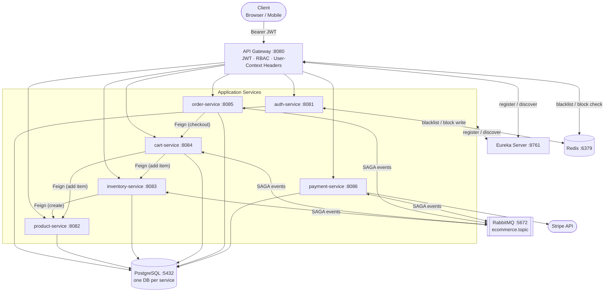

# E-Commerce Microservices Platform


A reference e-commerce backend built with eight Spring Boot microservices. Implements JWT-based authentication with role/permission-based access control, a choreography-based checkout SAGA over RabbitMQ, and Stripe-hosted payment sessions — all wired together through Netflix Eureka service discovery.

---

## Demonstrated Patterns

| Pattern | Where |
|---|---|
| **Choreography SAGA** | Async checkout across four services over RabbitMQ with full compensation on every failure path |
| **Auth/downstream security split** | Gateway owns JWT validation and RBAC; downstream services are Spring-Security-free and read identity from injected headers |
| **Idempotent event processing** | `processed_events` table in every SAGA participant prevents double-handling on retry or redelivery |
| **Optimistic locking** | Inventory reservation uses a `version` column to safely handle concurrent stock updates |
| **Stripe Checkout** | Hosted payment sessions with configurable expiration, scheduler-based cleanup, and browser-redirect webhooks |
| **Dual-controller pattern** | Every resource has a public read-only controller and a separate admin write controller, enforced at the gateway |
| **Refresh token rotation** | Opaque 7-day refresh tokens stored as SHA-256 hashes; rotated on every `/refresh` call |

---

## Architecture



---

## Microservices

| Service | Port | Responsibility |
|---|---|---|
| `api-gateway` | 8080 | Single entry point — JWT validation, RBAC enforcement, user-context header injection |
| `auth-service` | 8081 | Identity & access — registration, login, JWT issuance, refresh/blacklist, full RBAC management |
| `product-service` | 8082 | Product catalog — categories and products, public read + admin write, soft delete |
| `inventory-service` | 8083 | Stock levels — total/reserved/available quantity per product; SAGA reservation & release |
| `cart-service` | 8084 | Shopping cart — per-user cart and line items; SAGA cart clearing on order confirmation |
| `order-service` | 8085 | Checkout & order lifecycle — SAGA orchestration, `PENDING → CONFIRMED → AWAITING_PAYMENT → PAID` state machine |
| `payment-service` | 8086 | Stripe Checkout sessions — payment lifecycle, expiration scheduler, webhook redirect handling |
| `eureka-server` | 8761 | Service registry — Netflix Eureka for load-balanced inter-service routing |
| `commons` | — | Shared library — `ApiEndpoints`, enums, DTOs, event payloads, base entities, exceptions |

---

## Technology Stack

| Technology | Version | Purpose |
|---|---|---|
| Java | 25 | Runtime (virtual threads enabled on all services) |
| Spring Boot | 3.5.14 | Application framework |
| Spring Cloud | 2025.0.1 | Gateway WebMVC, Eureka, OpenFeign, Retry |
| PostgreSQL | 17.5 | Primary data store (one database per service) |
| Redis | 7.4 | Token blacklist + user-block flags |
| RabbitMQ | 3.13 | SAGA event bus (topic exchange + dead-letter queues) |
| Stripe SDK | — | Hosted Checkout sessions |
| JJWT | 0.12.6 | JWT signing and validation |
| Flyway | — | Schema migrations (JPA runs in `validate` mode) |
| MapStruct | 1.6.3 | Entity ↔ DTO mapping |
| Springdoc OpenAPI | 2.8.16 | Swagger UI per service |

---

## Checkout SAGA Flow

The checkout flow is a **choreography-based saga** — no central orchestrator. Services react to each other's events via RabbitMQ topic exchange (`ecommerce.topic`).

### Happy Path

```
POST /orders/checkout
  1. order-service     fetches cart (Feign) → saves Order(PENDING)         → publishes [order.created]
  2. inventory-service [order.created]      → reserves stock               → publishes [inventory.reserved]
  3. order-service     [inventory.reserved] → sets Order(CONFIRMED)        → publishes [order.confirmed]  ← fan-out
  4. cart-service      [order.confirmed]    → clears cart
     payment-service   [order.confirmed]    → creates Stripe session       → publishes [payment.initiated]
  5. order-service     [payment.initiated]  → sets Order(AWAITING_PAYMENT), stores paymentLink
  ── user pays on Stripe-hosted page ──
  6. payment-service   Stripe redirect      → marks Payment(SUCCEEDED)     → publishes [payment.succeeded]
  7. order-service     [payment.succeeded]  → sets Order(PAID)             → publishes [order.paid]
  8. inventory-service [order.paid]         → decrements totalQuantity (reservation → sale)
```

### Compensation Paths

| Trigger | Compensation |
|---|---|
| Insufficient stock | `InventoryReservationFailedEvent` → order cancelled → `OrderCancelledEvent` (no-op release) |
| Cart clear fails | `CartClearFailedEvent` → order cancelled → `OrderCancelledEvent` → inventory releases stock |
| Payment fails or expires | `PaymentFailedEvent` → order cancelled → `OrderCancelledEvent` → inventory releases stock |

---

## Prerequisites

- **JDK 25**
- **Docker & Docker Compose** (for infrastructure)
- Gradle wrapper is included — no separate Gradle install required

---

## Quick Start

### 1. Start infrastructure

```bash
docker compose up -d
```

Starts PostgreSQL 17.5 (port 5432), Redis 7.4 (port 6379), and RabbitMQ 3.13 (ports 5672, 15672). The init script at `docker/postgres/init/` creates all six service databases automatically.

### 2. Start services in order

```bash
./gradlew :eureka-server:bootRun
./gradlew :auth-service:bootRun
./gradlew :product-service:bootRun
./gradlew :inventory-service:bootRun
./gradlew :cart-service:bootRun
./gradlew :order-service:bootRun
./gradlew :payment-service:bootRun
./gradlew :api-gateway:bootRun
```

> Eureka must be up before downstream services register; the gateway should start last.

### 3. Verify

Open `http://localhost:8761` — all services should appear in the Eureka dashboard within ~30 seconds.

---

## Local Development

```bash
# Build everything (includes tests)
./gradlew build

# Build a single module, skip tests
./gradlew :order-service:build -x test

# Run tests for a module
./gradlew :auth-service:test

# Run a specific test class
./gradlew :auth-service:test --tests "com.example.ecommerce.auth.service.impl.AuthServiceImplTest"
```

### Environment Variables

All services fall back to development defaults when these are not set. Override them for any non-local environment.

| Variable | Services | Dev Default |
|---|---|---|
| `JWT_SIGNING_KEY` | api-gateway, auth-service | Hardcoded fallback in `application.yml` — **must match in both services** |
| `STRIPE_API_KEY` | payment-service | Stripe test key in `application.yml` |
| `DB_USERNAME` / `DB_PASSWORD` | all data services | `admin` / `admin@123` |
| `RABBITMQ_USERNAME` / `RABBITMQ_PASSWORD` | order, inventory, cart, payment | `admin` / `admin@123` |

### Local Dev Credentials

> These credentials are for local development only and are not suitable for any other environment.

| Resource | Username | Password |
|---|---|---|
| Demo admin account | `admin` | `StrongPass123` |
| PostgreSQL | `admin` | `admin@123` |
| RabbitMQ Management UI | `admin` | `admin@123` |

---

## Service URLs

| Endpoint | URL |
|---|---|
| API (all requests) | `http://localhost:8080` |
| Eureka Dashboard | `http://localhost:8761` |
| RabbitMQ Management | `http://localhost:15672` |
| auth-service Swagger | `http://localhost:8081/swagger-ui.html` |
| product-service Swagger | `http://localhost:8082/swagger-ui.html` |
| inventory-service Swagger | `http://localhost:8083/swagger-ui.html` |
| cart-service Swagger | `http://localhost:8084/swagger-ui.html` |
| order-service Swagger | `http://localhost:8085/swagger-ui.html` |
| payment-service Swagger | `http://localhost:8086/swagger-ui.html` |

A Postman collection covering all endpoints is available at [`Ecommerce Microservice.postman_collection.json`](./Ecommerce%20Microservice.postman_collection.json).

---

## Project Structure

```
ecommerce-microservice/
├── api-gateway/          # JWT auth, RBAC, routing
├── auth-service/         # Identity, tokens, RBAC management
├── product-service/      # Product catalog
├── inventory-service/    # Stock management
├── cart-service/         # Shopping cart
├── order-service/        # Checkout & order lifecycle
├── payment-service/      # Stripe payment sessions
├── eureka-server/        # Service registry
├── commons/              # Shared library (no Spring Boot plugin)
├── docs/                 # Architecture & SAGA sequence diagrams
├── docker/postgres/init/ # PostgreSQL multi-database init script
├── compose.yml           # Infrastructure (Postgres, Redis, RabbitMQ)
└── build.gradle          # Root Gradle config with shared dependency versions
```

---

## Documentation

| Document | Contents |
|---|---|
| [api-gateway/README.md](./api-gateway/README.md) | JWT filter chain, RBAC helpers, route configuration |
| [auth-service/README.md](./auth-service/README.md) | Token lifecycle, refresh rotation, blacklisting, RBAC endpoints |
| [product-service/README.md](./product-service/README.md) | Dual-controller pattern, filtering, soft delete |
| [inventory-service/README.md](./inventory-service/README.md) | Quantity model, optimistic locking, SAGA messaging |
| [cart-service/README.md](./cart-service/README.md) | Cart model, stock validation at add-time, SAGA cart clear |
| [order-service/README.md](./order-service/README.md) | Order state machine, checkout flow, cancellation |
| [payment-service/README.md](./payment-service/README.md) | Stripe integration, expiration scheduler, webhook flow |
| [commons/README.md](./commons/README.md) | Shared types, event DTOs, `ApiEndpoints` constants |
| [docs/checkout-workflow.md](./docs/checkout-workflow.md) | SAGA sequence diagrams — happy path and all failure/compensation paths |

---

## Contributing

1. Fork the repository and create a feature branch from `master`.
2. Follow established patterns: dual controllers for public/admin splits, `ProblemDetail` (RFC 7807) for error responses, `ApiResponse<T>` for success responses, Flyway for all schema changes.
3. Add new route path constants to `ApiEndpoints` in `commons` first — both the controller and the gateway's `SecurityConfig` reference these constants.
4. Open a pull request with a description of the change and any relevant context.

---

## License

This project is licensed under the [MIT License](./LICENSE).
