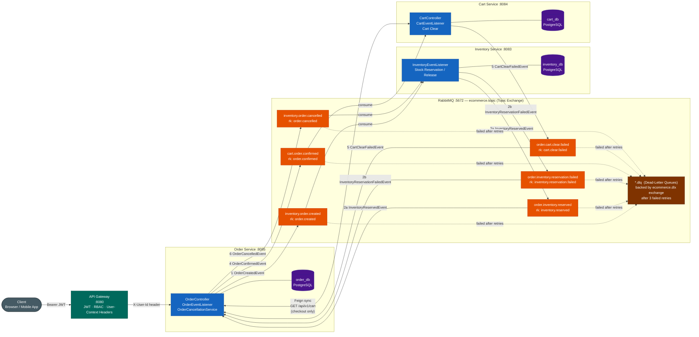
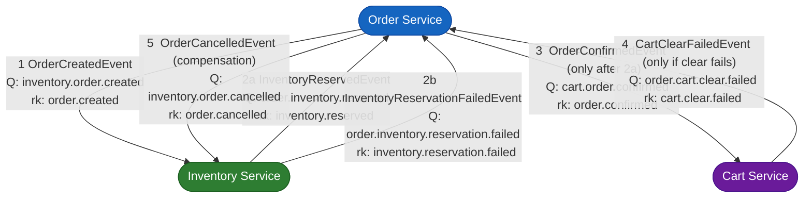
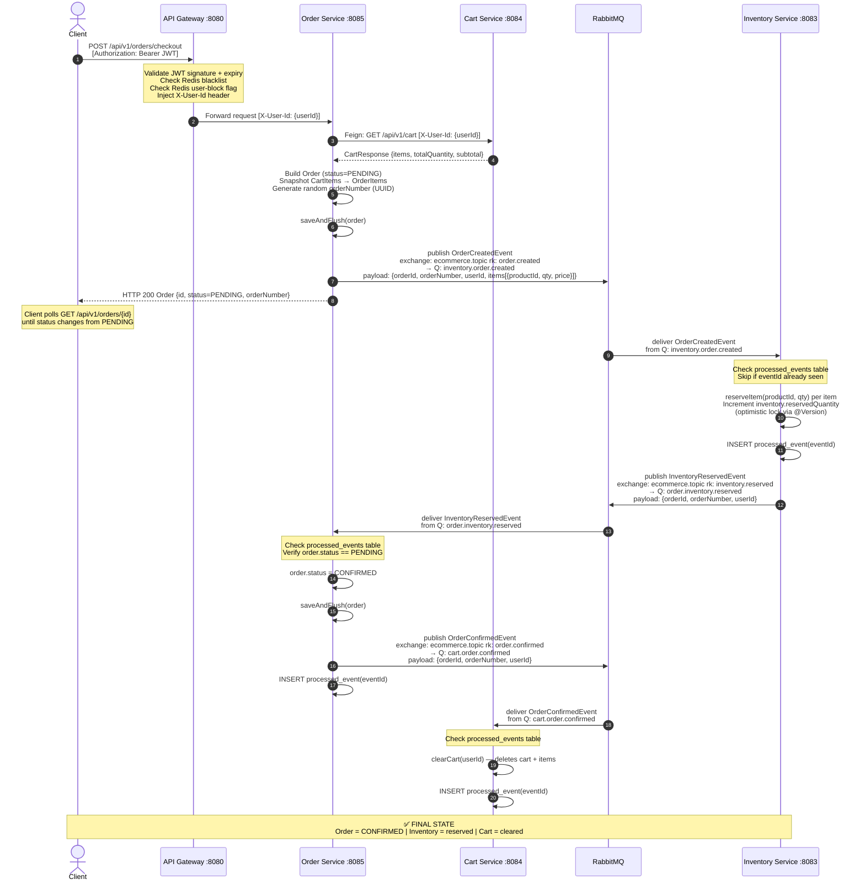
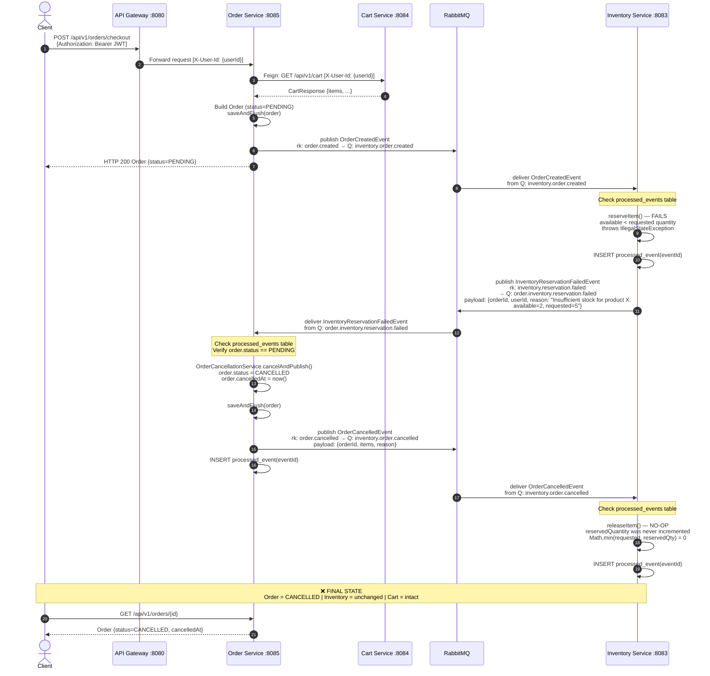
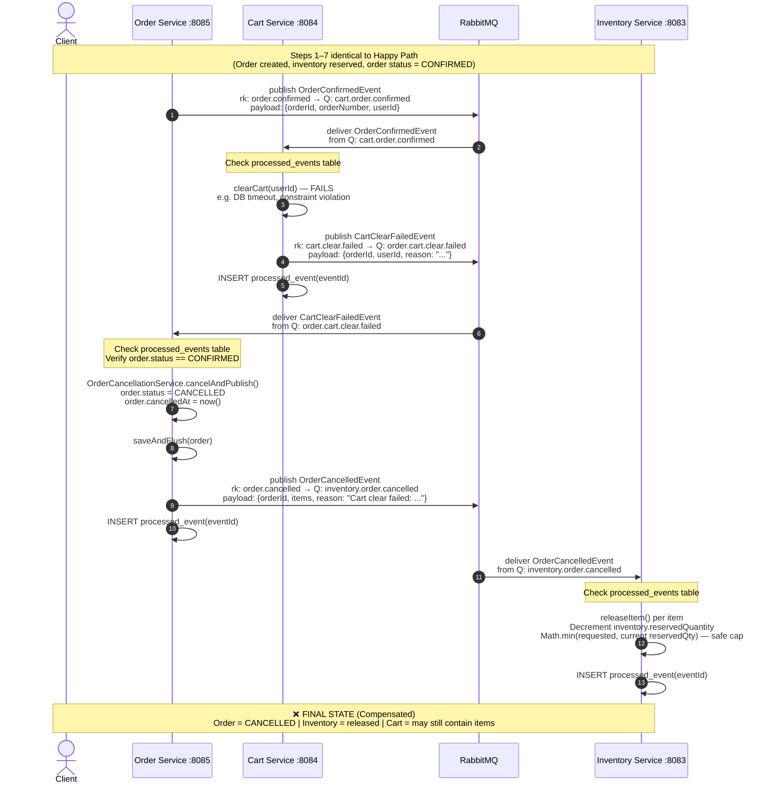
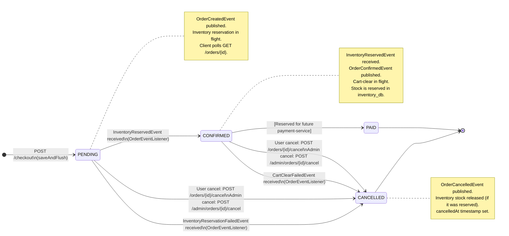

# Order Service — Checkout Workflow Diagrams

> **Pattern:** Choreography-based SAGA over RabbitMQ. Order-service does not call inventory-service
> synchronously at checkout. Instead it publishes domain events and reacts to replies, keeping each
> service independently deployable and failure-isolated.

---

## Table of Contents

1. [Event & Queue Reference](#event--queue-reference)
2. [Event Payload Details](#event-payload-details)
3. [Diagram 1 — High-Level Architecture](#diagram-1--high-level-architecture)
4. [Diagram 2 — Event Flow Map](#diagram-2--event-flow-map)
5. [Diagram 3 — Happy Path Sequence](#diagram-3--happy-path-sequence)
6. [Diagram 4 — Inventory Reservation Failure](#diagram-4--inventory-reservation-failure)
7. [Diagram 5 — Cart Clear Failure & Compensation](#diagram-5--cart-clear-failure--compensation)
8. [Diagram 6 — Order State Machine](#diagram-6--order-state-machine)

---

## Event & Queue Reference

All events travel through the **`ecommerce.topic`** Topic Exchange (RabbitMQ).
Every queue has a matching Dead-Letter Queue (`<name>.dlq`) backed by the **`ecommerce.dlx`** Direct Exchange.
Spring Retry delivers up to **3 attempts** (exponential back-off: 1 s → 10 s) before routing to the DLQ.

| # | Event Class | Routing Key | Queue Name | Publisher | Consumer |
|---|---|---|---|---|---|
| 1 | `OrderCreatedEvent` | `order.created` | `inventory.order.created` | order-service | inventory-service |
| 2 | `InventoryReservedEvent` | `inventory.reserved` | `order.inventory.reserved` | inventory-service | order-service |
| 3 | `InventoryReservationFailedEvent` | `inventory.reservation.failed` | `order.inventory.reservation.failed` | inventory-service | order-service |
| 4 | `OrderConfirmedEvent` | `order.confirmed` | `cart.order.confirmed` | order-service | cart-service |
| 5 | `CartClearFailedEvent` | `cart.clear.failed` | `order.cart.clear.failed` | cart-service | order-service |
| 6 | `OrderCancelledEvent` | `order.cancelled` | `inventory.order.cancelled` | order-service | inventory-service |

---

## Event Payload Details

| Event | Key Fields |
|---|---|
| `OrderCreatedEvent` | `eventId` (UUID), `occurredAt`, `orderId`, `orderNumber` (UUID), `userId`, `items` → `[{productId, quantity, unitPrice, productName}]` |
| `InventoryReservedEvent` | `eventId`, `occurredAt`, `orderId`, `orderNumber`, `userId` |
| `InventoryReservationFailedEvent` | `eventId`, `occurredAt`, `orderId`, `orderNumber`, `userId`, `reason` (String) |
| `OrderConfirmedEvent` | `eventId`, `occurredAt`, `orderId`, `orderNumber`, `userId` |
| `CartClearFailedEvent` | `eventId`, `occurredAt`, `orderId`, `orderNumber`, `userId`, `reason` (String) |
| `OrderCancelledEvent` | `eventId`, `occurredAt`, `orderId`, `orderNumber`, `userId`, `items` → `[{productId, quantity, ...}]`, `reason` (String) |

> **Idempotency:** Every consumer checks a `processed_events` table (`UUID eventId` PK) before handling
> an event and inserts after. A `DataIntegrityViolationException` on duplicate insert is silently swallowed
> to handle concurrent redeliveries. This prevents double-reservation, double-cancellation, etc.

---

## Diagram 1 — High-Level Architecture

Shows all participating services, their databases, the RabbitMQ topology, and the synchronous Feign call.

---

## Diagram 2 — Event Flow Map

Simplified view: which service publishes which event, which queue carries it, and who consumes it.
Numbers indicate the typical order of events in the happy path.

---

## Diagram 3 — Happy Path Sequence

**Scenario:** Customer checks out. Cart is non-empty. All items are in stock. Cart clears successfully.
**Result:** `Order = CONFIRMED`, inventory reserved, cart cleared.

---

## Diagram 4 — Inventory Reservation Failure

**Scenario:** One or more items do not have enough available stock.
**Result:** `Order = CANCELLED`, inventory unchanged, cart intact.

---

## Diagram 5 — Cart Clear Failure & Compensation

**Scenario:** Inventory reservation succeeds (order is CONFIRMED), but the cart-clear step fails
(e.g. DB error). The SAGA compensates by cancelling the now-confirmed order and releasing the
reserved stock.
**Result:** `Order = CANCELLED`, inventory stock released, cart may still contain items.

---

## Diagram 6 — Order State Machine

All possible `OrderStatus` transitions and the trigger for each.

---

## Compensation Summary

| Trigger | Order transitions | Compensation action |
|---|---|---|
| Insufficient stock | `PENDING → CANCELLED` | `OrderCancelledEvent` → inventory releases (no-op, nothing was reserved) |
| Cart clear fails | `CONFIRMED → CANCELLED` | `OrderCancelledEvent` → inventory releases reserved stock |
| User/Admin cancel | `PENDING → CANCELLED` | `OrderCancelledEvent` → inventory releases (safe-capped) |
| User/Admin cancel | `CONFIRMED → CANCELLED` | `OrderCancelledEvent` → inventory releases reserved stock |

> **Idempotency guarantee:** If any event is redelivered (network retry, consumer restart), the
> `processed_events` table prevents double-processing. A `DataIntegrityViolationException` on
> concurrent insert is silently swallowed — the first writer wins.
